# Login App - Responsive and Testing.

## Especificaciones de versión Angular.

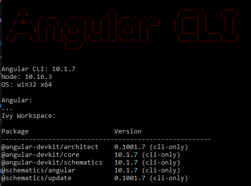

## Login Page.

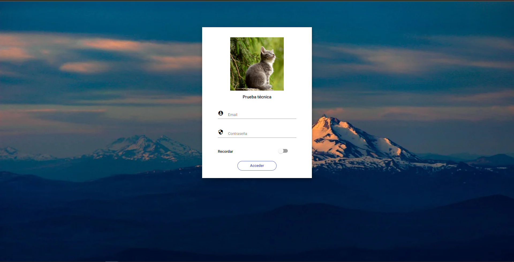

## Alertas de error en el formulario.

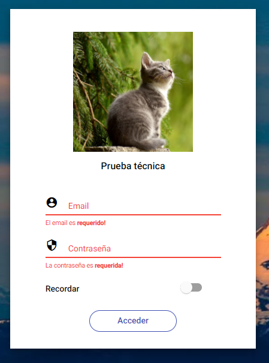

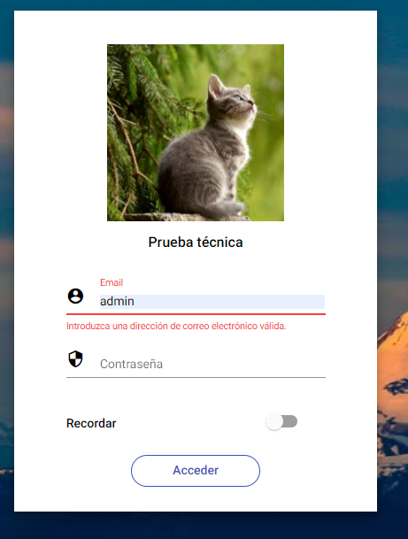

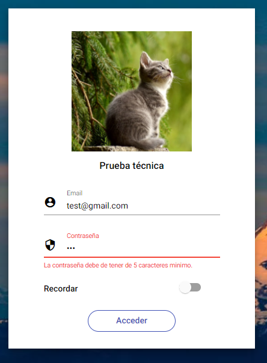

## Responsive Movil y iPad.

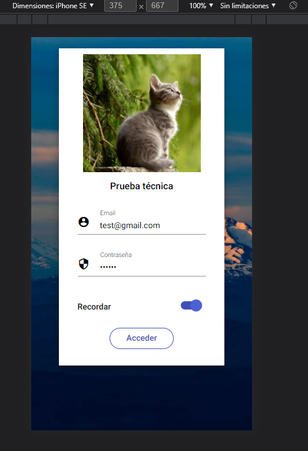

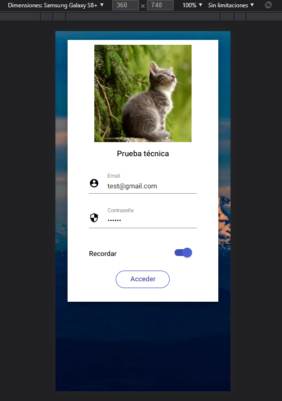

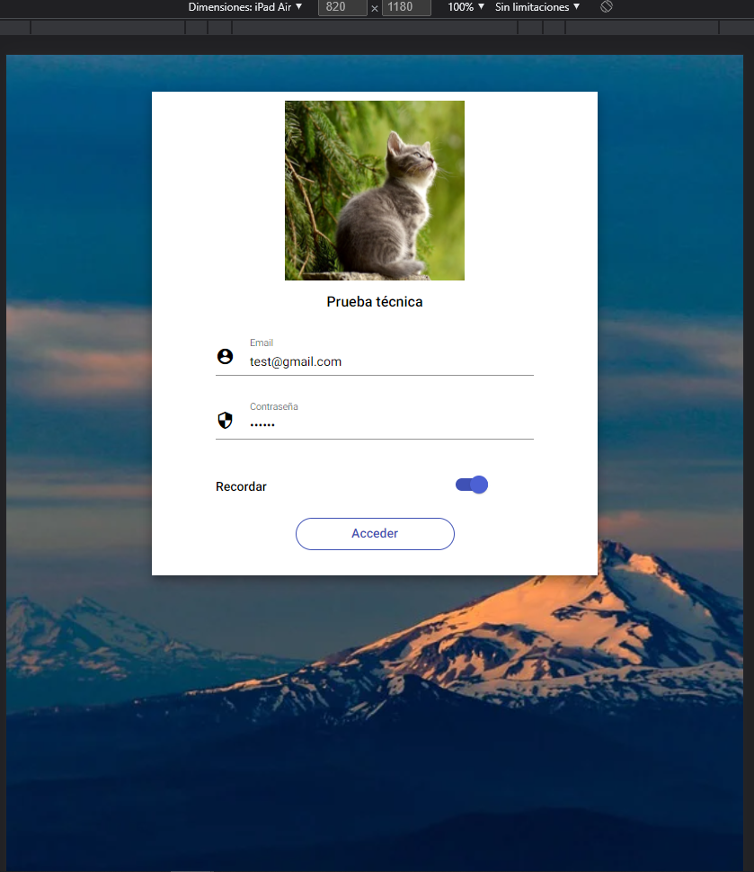

## Test y Coverage

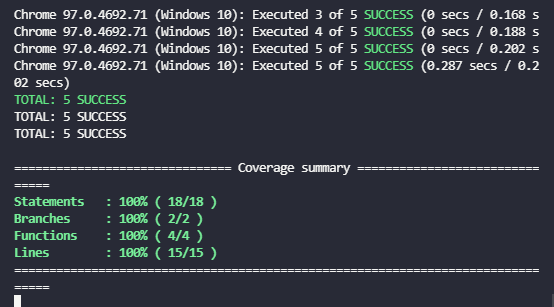

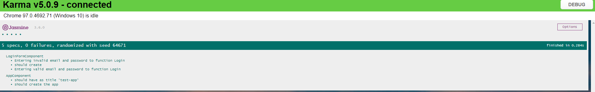

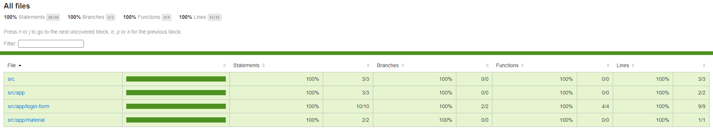

# Joel B.
